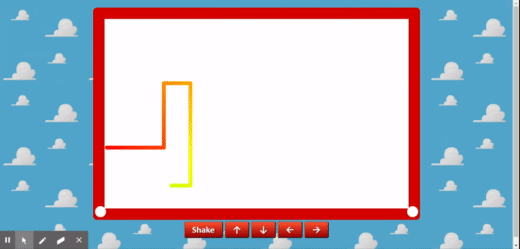

# Etch-A-Sketch

* Remember Etch-A-Sketch? How could you forget?? This game is going to take you back to your childhood, Have fun!! 

## Getting Started

* Installing
Follow the instructions in this section to get the app setup to run on your machine.

Clone the git project to your machine (example below is using ssh)

git clone git@github.com:jm27/Etch-A-Sketch.git

## Demo

There is a demo of this app available on github. You can interact with the app and see the full functionality. 

Each time the page loads the first dot starts in a random position of the canvas.

Use your keybord arrows to move around the canvas, this App is accesible for people withouth keyboards, just click on the arrow directions you wish your line to move to!

When you feel like starting from scratch, just click on the Shake button or refresh the page.

Have Fun!!

## Visit Demo Site

[Etch-A-Sketch LINK](https://jm27.github.io/Etch-A-Sketch/ "Homepage")
======

## Built With

* HTML.
* CSS.
* JavaScript

## Versioning
Etch-A-Sketch V1.1

## Authors

* **Jesus Esquer** - *Main Contributor* - [jm27](https://github.com/jm27)

## Acknowledgments

* Thanks to Classmates, Instructors, and TA's .
* Bootcamp 2019-2020.
